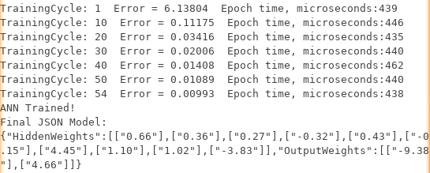
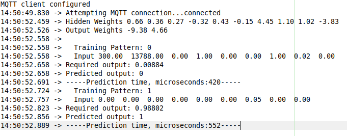
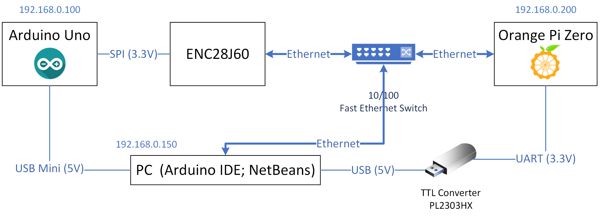

# MEML
Resource-aware MQTT-based Machine Learning for Network Attacks Detection on IoT Edge Devices

## Description
This is a proof-of-concept implementation of the propocal for Machine Learning (Neural Network) model update on resource-limited devices based on the Message Queuing Telemetry Transport (MQTT) without model re-training. Through this, one could put all unnecessar yand heavy computations of model training and meta-heuristic opti-mization on more powerful IoT gateway devices.  At the same time, less computationally-expensive testing phase will be performed on the IoT node devices. Orange Pi Zero was used as training platform (IoT gateway) and Arduino UNO v3 as testing platform (IoT node).
 MEML is cross-platform multi-agent system that includes parts of ArduinoANN adopted to ARM/AVR bundle.

# Training phase (on ARM using KDD Cup 1999 for Neural Network training)

# Testing phase (on ARM based on Neural Network parameters transferred from ARM through MQTT)

## IoT setup 
- Orange Pi Zero(CPU Quad-Core ARM Cortex-A7 @ 1.296GHz, RAM256MBytes, WiFi, Ethernet), IP address 192.168.0.200
- Arduino Uno (microcontroller ATmega328P, Flash 32Kbytes, RAM 2 KBytes, EEPROM 1 Kbyte), IP address 192.168.0.100
- ENC28J60 Ethernet controller for Arduino
- 5 ports 10/100 Fast Ethernet Switch
- TTL USB convertor PL2303HX 

## Original Paper
You can find more information about the practical experiments and datasets in the following conference paper:

	@INPROCEEDINGS{shalaginov2019meml,
		title={MEML: Resource-aware MQTT-based Machine Learning for Network Attacks Detection on IoT Edge Devices},
		author={Shalaginov, Andrii and Semeniuta, Oleksandr and Alazab, Mamoun},
		booktitle={Proceedings of the 12th IEEE/ACM International Conference on Utility and Cloud Computing Companion},
		pages={123--128},
		year={2019}
	}

## Dataset
One  of  the  most  commonly  used  datasets  is  KDD Cup  1999  describing  network  attack  patterns.  The highest performance can be achieved us-ing only 9 features out of 41 to reduce the complexity (src_bytes, dst_bytes, hot, logged_in, root_shell, is_guest_login, same_srv_rate, dst_host_srv_diff_host_rate, dst_host_srv_rerror_rate).   Here we focus on improved NSL-KDD dataset suggested by Tavallaee et al. with corresponding 9 features. For the demon-stration, it was selected 100 data samples representing normal trafficand "neptune"attack (IP SYN Flood in a short time frame).

## Requirements
- ANN Training: Orange Pi Zero
-- Debian Buster with Armbian Linux 4.19.62-sunxi
-- g++ (tested on v. 4:8.3.0-1 and higher)
-- v.1.67.0-13 for uBLAS vectors torage and JSON serialization
-- libmosquittopp v.1.5.7-1 (MQTT version 3.1/3.1.1 client C++ libraryand corresponding Broker), add "-lmosquitto" to linker
-- STL containers for data operations

- ANN Testing: Arduino UNO v3
-- Arduino IDE v 1.8.12
-- UIPEthernet library 2.0.7
-- PubSubClient 2.7.0
-- ArduinoJson 6.11.5
-- ArduinoANN

To reduce the size of the AVR code and accommodate larger packers, configuration of the first and second libraries were changed to UID_CONF_UDP_CONNS=1 and MQTT_MAX_PACKET_SIZE=256.

## Misc
Used Artificial Neural Network Training (ARM) and Testing (AVR) are adaptation from "Neural Network for Arduino" project (http://robotics.hobbizine.com/arduinoann.html).

